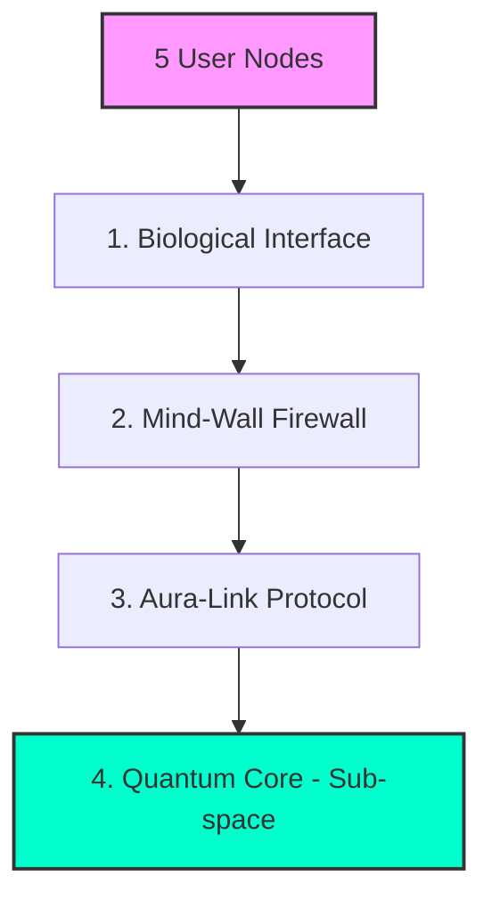

# The-Omnisync-Fabric-OSF
## 1. Architecture Specification (OSF)

## Document Control
| Version | Date | Author | Role | Changes |
| :--- | :--- | :--- | :--- | :--- |
| v1.0 | 2026-02-26 | รัชนาท ประเสริฐศิลป์ | Architect | Initial architectural review for Alpha + 1 |

**The Omnisync Fabric (OSF)** ถูกออกแบบโดยใช้สถาปัตยกรรมแบบ Meta-Physical Layered Architecture ซึ่งผสมผสานระหว่างการประมวลผลข้อมูลทางชีวภาพ (Biological Computing) และการจำลองการสื่อสารเชิงควอนตัม (Quantum Communication Simulation) โครงสร้างของระบบถูกแบ่งออกเป็น 4 เลเยอร์หลัก ดังนี้:

---

## 1.1 Biological Interface Layer (Data Ingestion & Processing)
ชั้นนี้ทำหน้าที่เป็นจุดรับข้อมูล (Endpoint) จากผู้ใช้ทั้ง 5 คน (Nodes) โดยมีหน้าที่หลักในการดึงข้อมูลดิบและแปลงให้อยู่ในรูปแบบที่ระบบเข้าใจได้

* **Biological Signal Converters:** จำลองการรับค่าสัญญาณชีพ (เช่น อัตราการเต้นหัวใจ, คลื่นสมอง) และแปลง (Digitize) สัญญาณเหล่านั้นให้เป็น Data Object
* **Full-Spectrum Data Normalization:** ข้อมูลความรู้สึกและประสาทสัมผัส (Senses/Emotions) จะถูกนำมาทำ Normalization ให้อยู่ในสเกลมาตรฐาน เพื่อลดความคลาดเคลื่อนก่อนส่งเข้าสู่เครือข่าย
* **Neural Coupling Agent:** เป็น Background Service ที่รันอยู่ที่ฝั่งผู้ใช้แต่ละคน เพื่อรักษาความเสถียรของการเชื่อมต่อกับส่วนกลาง

## 1.2 Aura-Link Protocol (Network & Routing Layer)
นี่คือโปรโตคอลแกนหลัก (Core Protocol) ที่ถูกพัฒนาขึ้นมาเฉพาะสำหรับ OSF

* **Empathy-Based Routing Engine:**
  อัลกอริทึมในการหาเส้นทาง (Pathfinding) จะไม่ประเมินจากความเร็วหรือระยะทางฮาร์ดแวร์ แต่ใช้ "Weight ของความสัมพันธ์" (Relationship Ties) เป็นตัวกำหนด Metric หาก Node A และ Node B มีค่าความสัมพันธ์ที่ตั้งไว้สูง (High Empathy Score) ข้อมูลจะถูกจัดลำดับ Priority ให้ส่งถึงกันก่อนเสมอ
  
* **OSF Packet Structure:**
  โครงสร้างของแพ็กเก็ตข้อมูลจะถูกแบ่งเป็น 3 ส่วน:
  * **Header:** ระบุ Sender Node และ Receiver Node
  * **Emotional Metadata:** ระบุประเภทและความเข้มข้นของความรู้สึก
  * **Sensory Payload:** ข้อมูลดิบของประสบการณ์ที่ต้องการส่งผ่าน

## 1.3 Quantum Core (Sub-space Transport Layer)
ส่วนนี้คือการจำลองตัวกลางในการส่งข้อมูล (Transport Medium) ที่ตั้งเป้าหมายไว้ที่ Zero Latency

* **Entanglement State Manager:** ระบบบริหารจัดการสถานะ "พัวพัน" ระหว่าง Node ทั้ง 5 โดยมองว่าแต่ละ Node เป็น Object ที่อ้างอิงสถานะร่วมกัน เมื่อมีการเปลี่ยนแปลงค่า (State Change) ที่ Node หนึ่ง ระบบจะใช้เทคนิคการอัปเดตแบบ Asynchronous Event-driven เพื่อให้ Node อื่นๆ รับรู้สถานะได้แบบเรียลไทม์
* **Sub-space Syncing:** การจำลองท่อส่งข้อมูลแบบพิเศษที่ตัดเรื่อง Bandwidth limitation ทิ้งไปในเชิงคอนเซปต์ โดยเน้นไปที่ความต่อเนื่องของการซิงค์ข้อมูล (Continuous State Synchronization)

## 1.4 Mind-Wall Firewall (Security & Access Control Layer)
ชั้นความปลอดภัยที่สำคัญที่สุด เพื่อป้องกันไม่ให้ข้อมูลทางความรู้สึกถูกแทรกแซง หรือส่งผลกระทบเชิงลบต่อผู้รับ
* **Cognitive Intrusion Detection System (CIDS):** ระบบตรวจจับความผิดปกติ หากพบว่ามีแพ็กเก็ตข้อมูลที่มีค่า "อารมณ์ด้านลบสูงเกินขีดจำกัด" (เช่น ความโกรธจัด หรือความกลัวที่อาจสร้าง Trauma) ระบบจะทำการดรอป (Drop) แพ็กเก็ตนั้นทิ้งทันที
* **Quantum-Key Privacy:** การเข้าถึงจิตสำนึกหรือความจำเฉพาะส่วน จะต้องได้รับการ Authorized จากเจ้าของข้อมูลเท่านั้น โดยจำลองกลไกการเข้ารหัสแบบ Public/Private Key ที่ผูกกับ Biological Signature ของผู้ใช้แต่ละคน

## 1.5 System Diagram Representation
ลำดับการไหลของข้อมูลในระบบ OSF:

## 1.6 Protocol Header Specification (Aura-Link Packet Structure)
เพื่อให้การทำงานของ Aura-Link Protocol ชัดเจนขึ้น เราได้ออกแบบโครงสร้างแพ็กเก็ตข้อมูล (OSF Packet) ที่ต่อยอดมาจากแนวคิดของ TCP/IP แต่ปรับแต่งให้รองรับ Meta-Physical Data โดยแพ็กเก็ตมาตรฐานขนาด 1024 Bytes จะถูกแบ่งโครงสร้างดังนี้:
* **OSF Header (128 Bytes):**
  * **Source_Node_ID (16 Bytes):** ระบุตัวตนผู้ส่ง
  * **Dest_Node_ID (16 Bytes):** ระบุตัวตนผู้รับ
  * **Empathy_Routing_Metric (32 Bytes):** ค่าที่ใช้คำนวณ Priority ในการส่งข้อมูล (ยิ่งค่าความสัมพันธ์สูง ข้อมูลยิ่งถูกจัดคิวส่งเร็วขึ้น)
  * **Quantum_Sync_Timestamp (64 Bytes):** Timestamp ระดับไมโครวินาทีเพื่อป้องกันปัญหา Data Out-of-sync
* **Sensory Payload (768 Bytes):** พื้นที่สำหรับบรรจุข้อมูล Biological Data ที่ผ่านการแปลงสัญญาณแล้ว (เช่น คลื่นสมอง, อัตราการเต้นของหัวใจ)
* **Footer & Security (128 Bytes):**
  * **Mind-Wall Checksum (64 Bytes):** ตรวจสอบความสมบูรณ์ของแพ็กเก็ตว่าไม่มีการแทรกแซงหรือดัดแปลงระหว่างทาง
  * **Quantum_Key_Signature (64 Bytes):** ลายเซ็นดิจิทัลที่ผูกกับรหัสชีวภาพของผู้ส่ง

## 1.7 Object-Oriented System Design (Core Classes)
โครงสร้างซอฟต์แวร์ฝั่ง Biological Interface ถูกออกแบบโดยใช้หลักการ Object-Oriented Programming (OOP) เพื่อความยืดหยุ่นในการรองรับประสาทสัมผัสที่หลากหลาย:
* **Interfaces & Polymorphism:**
  * **สร้าง Interface BioSignal** ซึ่งกำหนดเมธอดพื้นฐาน เช่น normalizeData() และ encryptSignal()
  * **คลาสย่อยต่างๆ** เช่น BrainWave, HeartRate, และ NerveImpulse จะทำการ Implements ตัว Interface นี้ ทำให้ระบบสามารถจัดการประเภทข้อมูลชีวภาพที่แตกต่างกันผ่าน Polymorphism ได้อย่างเป็นระเบียบ
* **Aggregation:**
  * **คลาสหลัก OSFNode (ตัวแทนของผู้ใช้แต่ละคน)** จะประกอบไปด้วยออบเจกต์ของ BioSignal หลายๆ ประเภทมารวมกัน (Aggregation) เพื่อสร้างเป็นแพ็กเก็ตข้อมูลประสบการณ์แบบ Full-Spectrum ก่อนส่งเข้าสู่ Sub-space

## 1.8 Database Architecture & EER Concept (Node Management)
แม้ข้อมูลส่วนใหญ่จะวิ่งผ่าน Sub-space แบบเรียลไทม์ แต่ระบบยังต้องการฐานข้อมูลเชิงสัมพันธ์ (Relational Database) แบบรวมศูนย์ เพื่อจัดการโครงสร้างเครือข่ายของคนทั้ง 5 คน:
* **Entity-Relationship (EER) Design:**
  * **Entity UserNode: เก็บข้อมูลพื้นฐานและ Public Key ของสมาชิก**
  * **Associative Entity EmpathyLink:** ตารางเชื่อมความสัมพันธ์แบบ Many-to-Many ระหว่าง Node เพื่อเก็บค่า Empathy_Weight (ระดับความสัมพันธ์) ซึ่งค่านี้จะถูกนำไปใช้อ้างอิงในการทำ Routing ของข้อมูล
  * **Entity SessionLog:** เก็บเฉพาะ Metadata ของการเชื่อมต่อ (เช่น เวลาเริ่ม, ขนาดแพ็กเก็ต, Node ที่เชื่อมต่อ) โดยไม่เก็บ Payload ที่เป็นความรู้สึกส่วนตัว เพื่อรักษาความเป็นส่วนตัวตามกฎของ Mind-Wall
* **Data Integrity & Normalization:** โครงสร้างตารางทั้งหมดถูกออกแบบให้อยู่ในรูปแบบ 3NF (Third Normal Form) เพื่อลดความซ้ำซ้อนของข้อมูล และอาจมีการเขียน Stored Procedures เข้ามาช่วยคำนวณค่า Registration Fee หรือ Cost ของการส่งข้อมูลที่ใช้ Bandwidth สูง (ถ้าในอนาคตต้องการสเกลระบบ)
