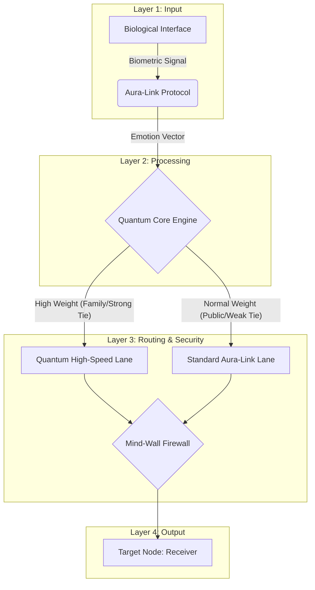

Layer 1 (Input): คือส่วนที่รับค่า emotion และ tie_score (สัญญาณชีพจรและน้ำหนักความสัมพันธ์)

Layer 2 (Processing): คือขั้นตอนที่ระบบกำลังแปลงข้อมูล (ที่มีคำว่า time.sleep เพื่อจำลองการประมวลผล)

Layer 3 (Routing & Security): ในโค้ดคือคำสั่ง if tie_score >= 0.7

ถ้าค่าสูง = ไป High-Speed Lane (ตามผัง) ถ้าค่าต่ำ = ไป Standard Lane (ตามผัง) และทั้งคู่ต้องผ่าน Mind-Wall Firewall ก่อนเสมอ

Layer 4 (Output): ในโค้ดคือส่วนสุดท้ายที่ print ว่าส่งสำเร็จไปยังผู้รับครับ

#Code
https://colab.research.google.com/drive/1yel7eCmnyx4npowdyZSJW1fRzHUwpppG?usp=sharing
