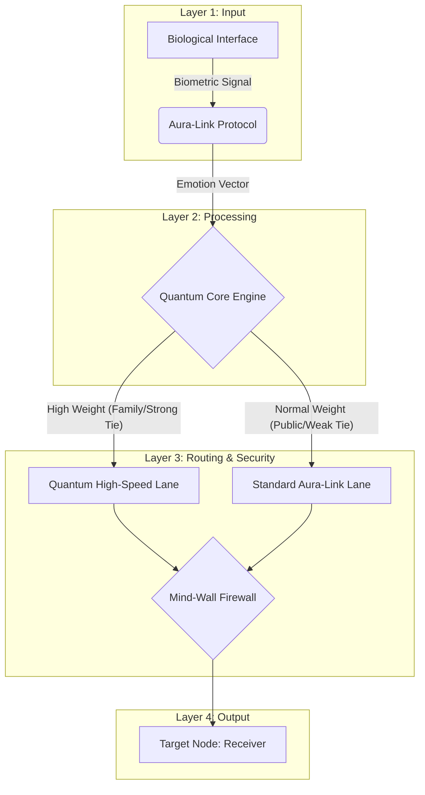

```mermaid
graph TD
    subgraph "Layer 1: Input"
    A[Biological Interface] -- "Biometric Signal" --> B(Aura-Link Protocol)
    end

    subgraph "Layer 2: Processing"
    B -- "Emotion Vector" --> C{Quantum Core Engine}
    end

    subgraph "Layer 3: Routing & Security"
    C -- "High Weight (Family/Strong Tie)" --> D[Quantum High-Speed Lane]
    C -- "Normal Weight (Public/Weak Tie)" --> E[Standard Aura-Link Lane]
    D --> F{Mind-Wall Firewall}
    E --> F
    end

    subgraph "Layer 4: Output"
    F --> G[Target Node: Receiver]
    end
```
