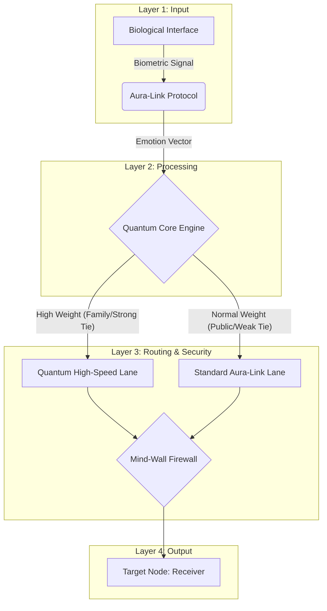

| เลเยอร์ (Layer) | ส่วนงาน (Component) | โลจิคในโค้ด (Code Logic) | หน้าที่ (Function) |
| :-----------| :------------------- | :---------------------| :---------------------------|
| **Layer 1** | Biological Interface | `input()`             | รับสัญญาณชีพจรจำลอง          |
| **Layer 2** | Aura-Link Protocol   | `time.sleep()`        | ประมวลผลและเข้ารหัสข้อมูลอารมณ์ |
| **Layer 3** | Quantum Core         | `if tie_score >= 0.7` | เลือกเส้นทางส่งข้อมูลตามความสัมพันธ์|
| **Layer 4** | Mind-Wall Firewall   | Security Check        | ตรวจสอบความปลอดภัยก่อนส่งออก  |
| **Layer 5** | Output               | `print()`             | ยืนยันการส่งข้อมูลถึงผู้รับ          |

#Code
https://colab.research.google.com/drive/1yel7eCmnyx4npowdyZSJW1fRzHUwpppG?usp=sharing
